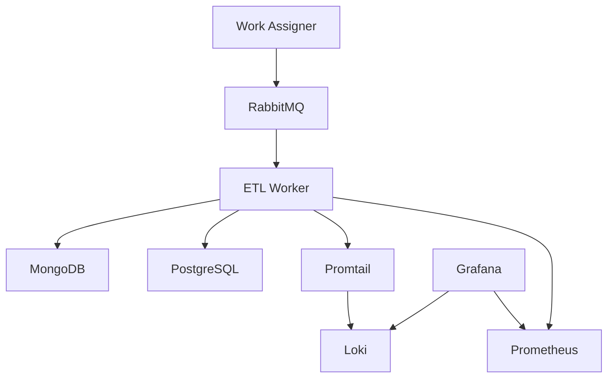
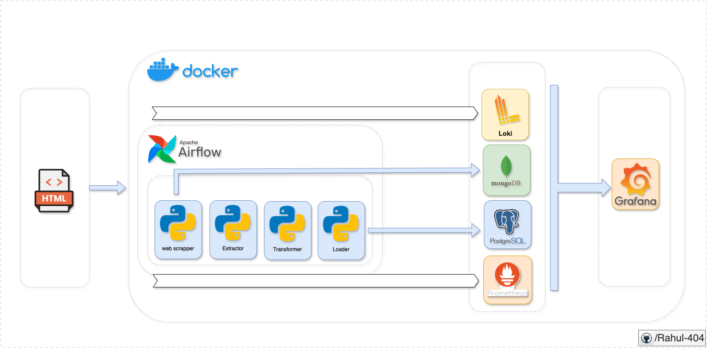

# Architecture Overview

The BBC News ETL Pipeline is designed with scalability, reliability, and maintainability in mind.

## Components

- **Scraper**: Extracts news articles from BBC News website using BeautifulSoup and Requests.
- **ETL Pipeline**: Processes and loads data into MongoDB.
- **Monitoring**: Uses Prometheus for metrics and Loki for logging.
- **Scheduler**: Apache Airflow orchestrates the pipeline tasks.

### Local Architecture

  <!-- Add your architecture diagram here -->
