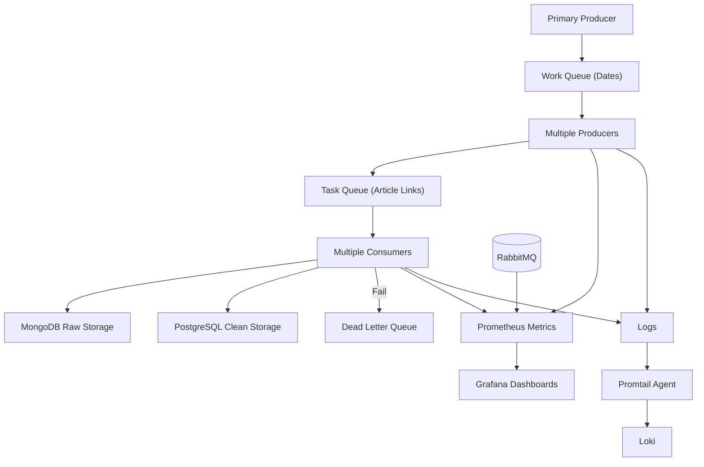

# High-Level Data Flow

This section provides an **end-to-end view of the BBC News ETL pipeline**, highlighting the flow of data from scraping to storage, monitoring, and failure handling.

---

## Overview

The pipeline is designed to **ingest news data reliably and at scale**. It follows a modular architecture with clearly separated concerns:

1. **Primary Producer & Work Queue**

      - The **primary producer** generates a **date-based work queue** based on configured `START_DATE` and `CURRENT_DATE`.
      - Checks **MongoDB (data lake)** for existing records and ensures minimum article count per date.
      - Pending dates are added to the Work Queue for scraping.

2. **Data Producers (Scrapers)**

      - Multiple producers (scaled by **KEDA**) pick dates from the Work Queue.
      - Scrape live and archived BBC News articles for assigned dates.
      - Perform **duplicate checks against MongoDB** before publishing.
      - Publish **unique article links** to the **Task Queue (RabbitMQ)**.

3. **Message Queue (RabbitMQ)**

      - Decouples producers and consumers.
      - Maintains **Work Queue**, **Task Queue**, and **Dead Letter Queue (DLQ)** for failed ETL tasks.
      - Supports **durable queues, acknowledgements, and retries**.

4. **Consumers / ETL Workers**

      - Fetch messages from the Task Queue.
      - Parse raw HTML into structured, analytics-ready data.
      - Apply transformations (cleaning, normalization, enrichment).
      - Store results in:

         - **MongoDB**: raw/unstructured HTML content.
         - **PostgreSQL**: cleaned, structured datasets.

      - Failed ETL messages are routed to **DLQ**.

5. **Observability & Monitoring**

      - **Prometheus** collects metrics from producers, consumers, and RabbitMQ.
      - **Grafana** visualizes pipeline performance via dashboards.
      - **Logs** from all components are sent via **Promtail → Loki** for centralized analysis.

6. **Deployment & Orchestration**

      - All components are **containerized**.
      - **Kubernetes + KEDA** handles autoscaling, health checks, and rolling updates.
      - **Helm charts** simplify deployment, configuration, and environment management.

---

## Data Flow Diagram

---

This updated diagram and overview now reflect:

* **Work Queue → Multiple Producers → Task Queue → Consumers**
* **DLQ** for failed ETL tasks
* **KEDA scaling** for Producers & Consumers
* **Promtail → Loki** for centralized logging
* **Prometheus → Grafana** for metrics dashboards
