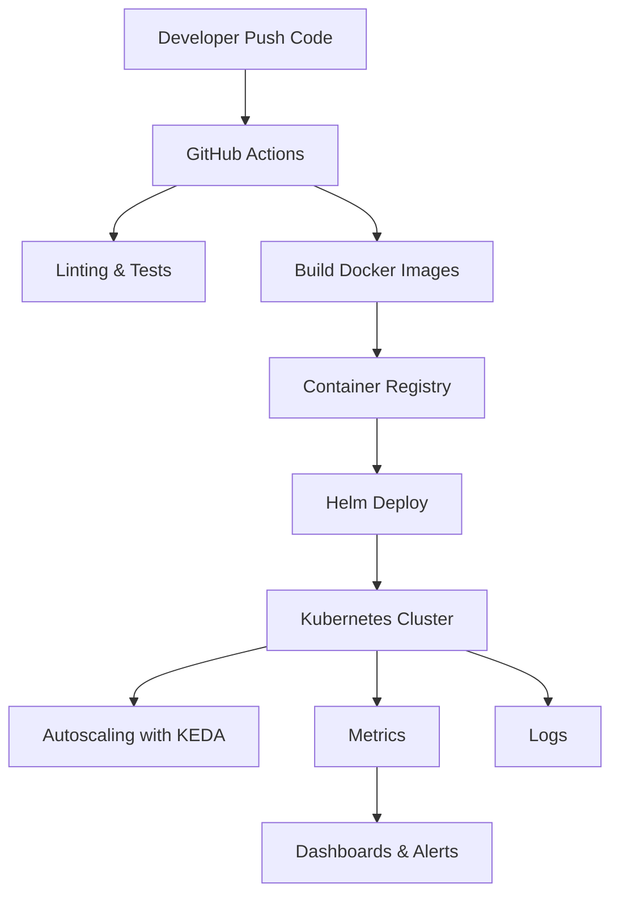

# CI/CD & Infrastructure

This project is built with a **cloud-native infrastructure mindset** and supports **continuous integration, continuous delivery (CI/CD), and reproducible infrastructure provisioning**.

---

## 1. CI/CD Pipeline

### GitHub Actions

- **Automated Builds**:
  Each commit triggers Docker image builds for Producers, Consumers, and supporting services.
- **Linting & Testing**:
  Unit tests, linting (`flake8`, `black`), and integration tests run on every PR.
- **Documentation Deployment**:
  MkDocs site is automatically built and deployed via GitHub Pages.
- **Security Scans**:
  Dependencies are checked for vulnerabilities using `pip-audit`.

### Jenkins (Optional Extension)

For enterprise environments, Jenkins can be integrated to:

- Run **end-to-end ETL jobs** in a staging environment.
- Deploy to Kubernetes clusters after passing automated QA gates.
- Support **manual approvals** for production rollout.

---

## 2. Infrastructure as Code (IaC)

Infrastructure is **defined declaratively** using **Terraform** and **Helm**:

### Terraform

- Provisions cloud resources (VMs, storage, networking, managed DBs).
- Ensures **reproducibility across environments** (dev, staging, prod).
- Example: Creates an **EKS cluster** (AWS) or **GKE cluster** (GCP).

### Helm

- Used to package and deploy Producers, Consumers, RabbitMQ, Prometheus, Grafana, and Loki.
- Supports **environment-specific values** (e.g., dev vs prod scaling).
- Simplifies rolling upgrades and rollback.

---

## 3. Deployment Workflow

1. **Developer pushes code → GitHub Actions runs tests & builds Docker images.**
2. **Images are pushed to a container registry** (e.g., AWS ECR, DockerHub, or GCP Artifact Registry).
3. **Helm + Terraform** deploy the updated components to Kubernetes.
4. **KEDA + Prometheus + Loki** ensure auto-scaling and observability.
5. **Grafana dashboards & alerts** notify if issues arise post-deployment.

---

## 4. Reliability in Deployment

- **Blue-Green Deployments**: New pods are tested before switching traffic.
- **Rollback Mechanism**: Helm allows rollback to a previous release if deployment fails.
- **Immutable Images**: Each release is tied to a Git commit SHA for traceability.
- **Secrets Management**: Handled via Kubernetes Secrets or Vault integration.

---

## 5. CI/CD Pipeline Diagram

---

## Key Highlights

- **Automated CI/CD** with GitHub Actions & optional Jenkins.
- **IaC with Terraform + Helm** ensures reproducible environments.
- **Scalable Kubernetes-native deployment**.
- **Built-in reliability** with blue-green deployment and rollback.
