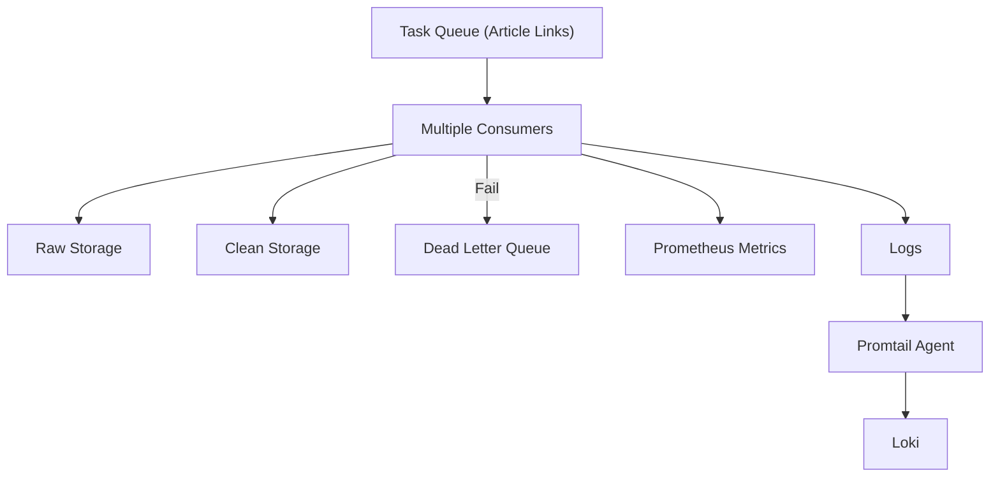

# Consumer (ETL Worker)

Consumers process **task messages from RabbitMQ**, perform ETL, and store results in MongoDB (raw) and PostgreSQL (cleaned). They also handle **failed ETL tasks** via a Dead Letter Queue (DLQ) and expose metrics/logs for observability.

---

## Responsibilities

- Fetch **article link messages** from the **Task Queue (RabbitMQ)**.
- Parse raw HTML into structured, analytics-ready records.
- Apply cleaning, normalization, and enrichment.
- Store:
    - **MongoDB** → raw data (data lake)
    - **PostgreSQL** → cleaned & analytics ready data (data warehouse)
- Handle failed ETL tasks:

    - Messages that fail ETL are **routed to DLQ** for manual inspection.

- Emit **metrics and logs** for observability:

    - Metrics → Prometheus
    - Logs → Promtail → Loki

---

## Implementation

- **Language**: Python 3.11
- **Libraries**: `pika`, `pandas`, `sqlalchemy`, `pymongo`
- **Features**:

  * Parallel processing of messages for high throughput.
  * Retry & DLQ integration for fault tolerance.
  * Metrics exposed to Prometheus.
  * Logs centralized via Promtail → Loki.
  * Fully containerized for Kubernetes deployment.

---

## Data Flow

----

## Key Highlights

* **Parallel & scalable**: KEDA spawns multiple Consumer pods based on Task Queue depth.
* **Reliability**: Failed ETL messages are captured in DLQ for manual recovery.
* **Observability**: Metrics + logs provide real-time insights into processing rates, failures, and ETL throughput.
* **Production-ready**: Fully containerized and ready for Kubernetes deployment.
