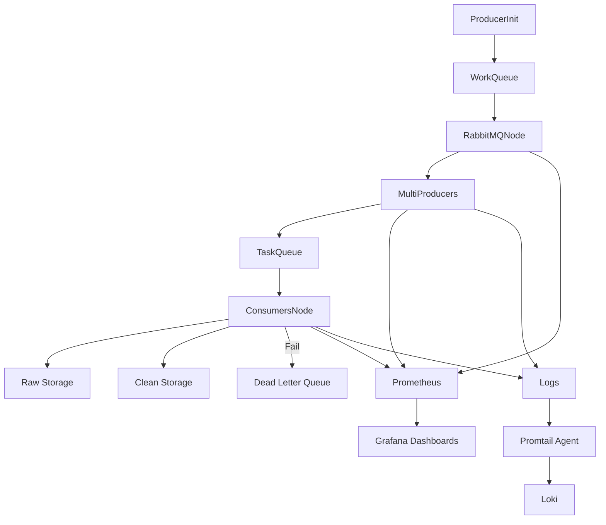

# Monitoring & Observability (Prometheus + Grafana + Loki)

This component ensures **full observability** of the ETL pipeline, including **metrics, logs, and dashboards** for producers, consumers, and RabbitMQ.

---

## Components

### Prometheus

- Collects metrics from all pipeline components:

    - **Producers** → scraped links, retries, work queue length
    - **Consumers** → ETL throughput, failed tasks
    - **RabbitMQ** → queue depth, message rates
- Enables alerts for failures, slow processing, or resource bottlenecks.

### Grafana

- Visualizes metrics via customizable dashboards.
- Provides **real-time insights** into system health and scaling behavior.
- Examples of dashboards:

    - Queue depth trends
    - Producer & Consumer throughput
    - DLQ failure rates

### Loki & Promtail

- **Producers and Consumers** send logs to **stdout/file**.
- **Promtail Agent** collects and forwards logs to **Loki**.
- Centralized logging includes:

    - Errors, retries, DLQ messages
    - Debug information for troubleshooting
- Supports querying, filtering, and dashboards in Grafana.

---

## Data Flow

---

## Key Highlights

- **Centralized observability**: metrics and logs from all components are aggregated.
- **Real-time monitoring & alerting**: track producer/consumer performance, queue depth, DLQ failures.
- **Kubernetes-friendly**: integrates seamlessly with containerized deployments and KEDA scaling.
- **Production-grade**: provides full visibility for debugging, scaling, and SLA monitoring.
