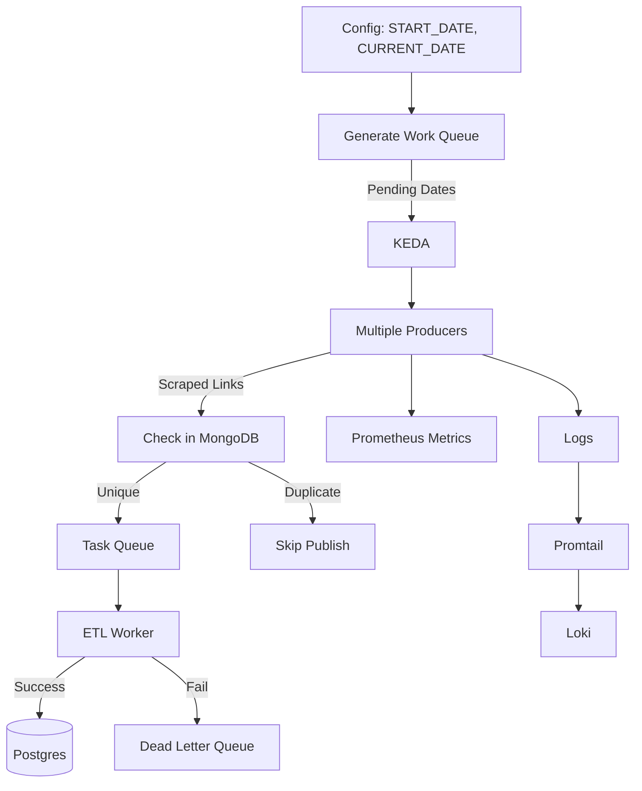

# Producer (Scraper & Orchestrator)

The **Producer** is responsible for orchestrating scraping tasks, generating work queues, and publishing unique BBC News article links into RabbitMQ for downstream ETL processing. It ensures **deduplication**, **autoscaling**, and **observability**.

---

## Responsibilities

- **Work Queue Generation**:

    - On start, the primary producer generates a **date-based work queue**.
    - Uses configuration values:

        - `START_DATE` → beginning of the scraping window.
        - `CURRENT_DATE` → dynamically calculated at runtime.

    - For each date in the range:

        - Checks **MongoDB (data lake)** for existing records.
        - If no records found → marks the date as a **work date**.
        - If **record count < statistical threshold** (configurable, e.g., average articles/day) → also mark the date as a **work date** to ensure data completeness.

    - Populates the **Work Queue** with all pending dates.

- **Task Distribution**:

    - KEDA scales **multiple producers** to pick up dates from the Work Queue.
    - Each producer scrapes **all article links for its assigned date**.
    - Publishes only **new and unique links** to the **Task Queue (RabbitMQ)**.

- **Message Publishing**:

    - Each task message contains:

        - Date
        - Article URL
        - Basic metadata
    - Sent to RabbitMQ for consumers.
    - Failed ETL tasks are routed to a **Dead Letter Queue (DLQ)** for manual recovery.

- **Observability**:

    - **Logs** → collected by **Promtail → Loki**.
    - **Metrics** → exposed for Prometheus (e.g., scraped links count, retries, duplicates skipped).

---

## Implementation
- **Language**: Python 3.11
- **Libraries**:

    - Scraping: `requests`, `BeautifulSoup4`, `Selenium`
    - Messaging: `pika` (RabbitMQ client)
    - Storage: `pymongo` (MongoDB connector)

- **Features**:

    - Date-based work queue generator.
    - Duplicate check against MongoDB.
    - Modular scraper with support for multiple BBC sections.
    - Error handling, retry logic, DLQ routing.
    - Configurable via environment variables.

---

## Data Flow

---

## Key Highlights

* **Orchestrator Role**: First producer creates work queue; others scale dynamically.
* **Duplicate Prevention**: MongoDB check ensures no redundant messages.
* **Autoscaling**: KEDA spawns Producers & Consumers based on queue length.
* **Failure Handling**: DLQ captures failed ETL tasks for manual inspection.
* **Production-grade Observability**: Logs → Loki, Metrics → Prometheus.
