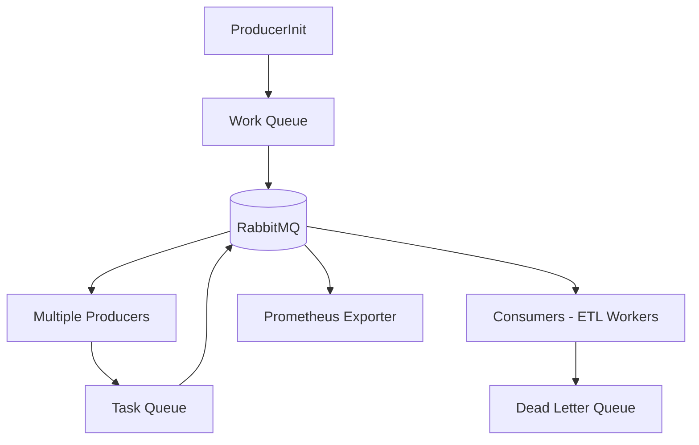

# Message Queue (RabbitMQ)

The **Message Queue** acts as the backbone of the pipeline, decoupling producers from consumers and ensuring reliable, ordered, and durable delivery of scraping and ETL tasks.

---

## Responsibilities

- Maintain **Work Queue** for Producers:

    - Stores **date-based tasks** generated by the primary producer.
    - Enables multiple Producers (scaled by KEDA) to pick pending dates and scrape them.

- Maintain **Task Queue** for Consumers:

    - Stores **scraped article links + metadata**.
    - Allows multiple Consumers to process tasks in parallel for ETL into storage systems.

- Provide **Dead Letter Queue (DLQ)**:

    - Captures failed ETL messages for manual inspection and replay.

- Ensure    -
    - **Durable storage** of messages (no data loss).
    - **Acknowledgements** for reliable message processing.
    - **Retry & requeue** support for transient failures.
    - **M-trics integration** for observability.

---

## Implementation

- **RabbitMQ** with:

    - **Durable queues** (Work Queue, Task Queue, DLQ).
    - **Prefetch settings** to prevent consumer overload.
    - **Acknowledgements** for guaranteed delivery.
- Integrated with **Prometheus RabbitMQ Exporter** for queue-level metrics.

---

## Data Flow

---

## Key Highlights

- **Two-tier queueing system**:

    - Work Queue (date orchestration) → drives Producers.
    - Task Queue (article links) → drives Consumers.

- **Autoscaling with KEDA**: queue depth automatically adjusts number of Producers and Consumers.

- **Reliability**: DLQ captures all failures for manual recovery.

- **Observability**: Queue depth, processing rates, and failures are exposed as Prometheus metrics.
