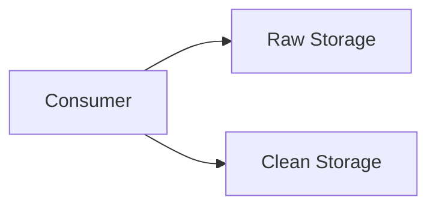

# Storage Layer (MongoDB + PostgreSQL)

This layer stores both **raw and processed news data**.

---

## Components

### MongoDB (Raw Storage)

- Stores unprocessed HTML and metadata.
- **Schema-less** design allows flexible storage of raw articles.
- Useful for auditing and reprocessing pipelines.

### PostgreSQL (Clean Storage)

- Stores structured, analytics-ready data.
- Supports indexes and optimized queries for downstream analytics.
- Versioned datasets for reproducibility.

---

## Data Flow

**Key Highlights**

- Separation of raw vs cleaned data ensures reproducibility.
- Optimized for analytics and reporting in PostgreSQL.
- Centralized backups for reliability and disaster recovery.
