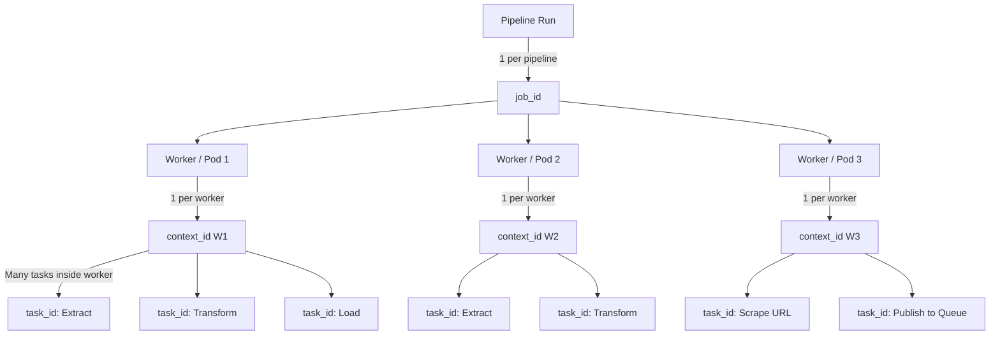

# Logs (Loki + Promtail)

Loki provides **centralized logging** for all components of the BBC News ETL pipeline. Promtail agents collect logs from each container/pod and send them to Loki for querying and visualization.

---

## 1. Overview

* Logs include **errors, retries, debug info, and operational events** from producers, consumers, and RabbitMQ.
* Loki integrates with **Grafana** to visualize logs alongside metrics.
* Promtail runs as a **sidecar or standalone agent** to collect container logs.

---

## 2. Log Sources

| Component           | Logs                                                                               |
| ------------------- | ---------------------------------------------------------------------------------- |
| Producers           | Scrape start/end, articles processed, retries, Selenium errors, task queue updates |
| Consumers           | ETL start/end, success/failure counts, DLQ messages, database errors               |
| RabbitMQ            | Message publish/consume events, queue depth alerts                                 |
| System / Kubernetes | Pod lifecycle events, scaling actions, resource metrics                            |

---

## 3. Log Format

* Structured logs in **JSON** are recommended for better querying.
* Example log entry from a producer:

```json
{
  "timestamp": "2025-09-28T12:00:00Z",
  "level": "INFO",
  "component": "producer",
  "section": "world",
  "articles_scraped": 15,
  "task_queue_length": 12
}
```

* Example log entry from a consumer:

```json
{
  "timestamp": "2025-09-28T12:01:00Z",
  "level": "ERROR",
  "component": "consumer",
  "etl_task_id": "abc123",
  "error": "PostgreSQL connection timeout",
  "retry_count": 2
}
```

---

## 4. Integration

* Promtail reads **container stdout/stderr**, **files**, or **systemd logs**.
* Sends logs to Loki over HTTP or gRPC endpoints.
* Grafana dashboards can **correlate logs with metrics** to identify pipeline bottlenecks.

---

## 5. Best Practices

* **Label logs** with `component`, `section`, `task_id`, and `environment` for filtering.
* Monitor **DLQ-related logs** to ensure no messages are lost.
* Use **retention policies** to manage storage.
* Secure Loki endpoints and use **role-based access control** for production environments.


