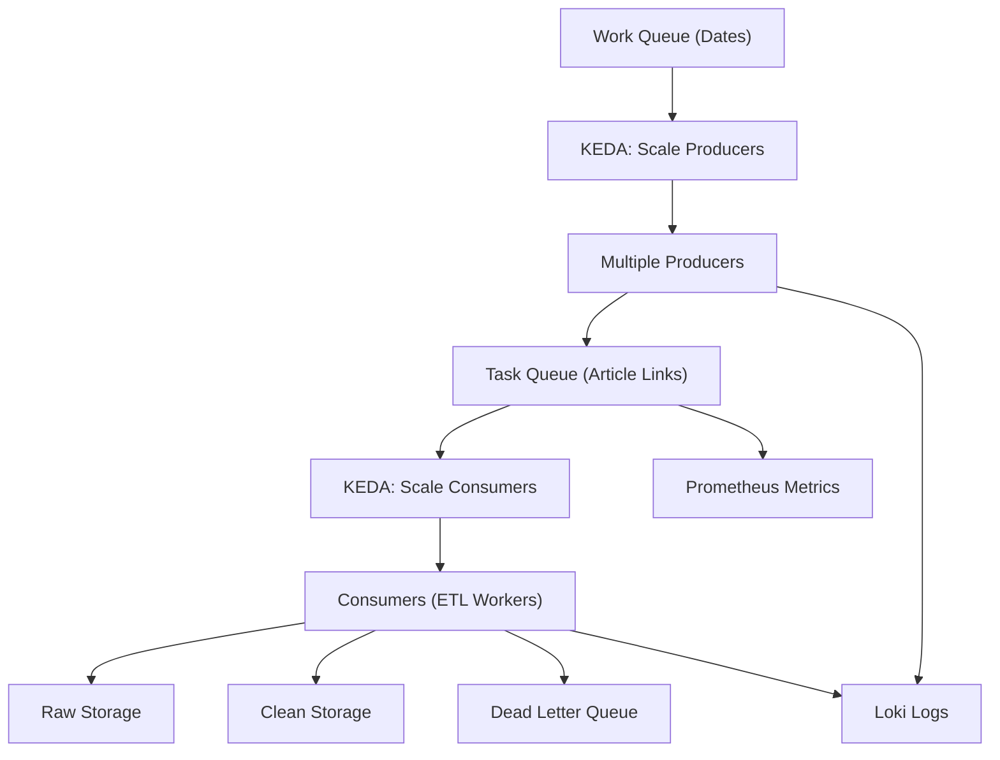

# Scaling & Reliability

The BBC News ETL Pipeline is designed to **handle large-scale news ingestion while maintaining high reliability**. This section explains how the system achieves **horizontal scaling, fault tolerance, and message reliability**.

---

## 1. Horizontal Scaling

The pipeline supports **dynamic scaling** of producers and consumers based on workload:

### Producers (Scrapers)

* Multiple producer instances can run in parallel to scrape different sections or dates.
* **Work queue** ensures each producer picks unique tasks to avoid duplication.
* KEDA autoscaling triggers scale-up or scale-down based on **work queue length**.

### Consumers (ETL Workers)

* Multiple consumers process tasks from RabbitMQ concurrently.
* Scaling is triggered based on **Task Queue depth**.
* Allows handling spikes in incoming article links efficiently.

---

## 2. KEDA Integration

* **KEDA (Kubernetes Event-driven Autoscaling)** is used to **dynamically scale pods**.
* **Primary producer** builds a work queue for dates requiring scraping.
* KEDA monitors the queue and **spins up multiple producers** as needed.
* Similarly, KEDA scales consumers based on **Task Queue length**.
* Ensures optimal resource usage without over-provisioning.

---

## 3. Reliability & Fault Tolerance

### Message Delivery

* RabbitMQ provides **durable queues** with **acknowledgements** to ensure no message loss.
* Failed ETL messages are sent to the **Dead Letter Queue (DLQ)** for manual inspection or retry.
* Retry policies and exponential backoff are applied before sending messages to DLQ.

### Data Reliability

* **MongoDB** stores raw HTML for archival purposes.
* **PostgreSQL** stores cleaned, analytics-ready datasets.
* Versioned datasets support **reproducibility** of ETL pipelines.

### Error Handling

* Producers handle **rate limits, retries, and Selenium errors** gracefully.
* Consumers log errors and failures to **Loki**, while metrics are sent to Prometheus for alerting.
* Observability allows operators to detect **bottlenecks or failures early**.

---

## 4. Key Highlights

* **Dynamic Scaling**: Producers & Consumers scale automatically with KEDA.
* **High Availability**: Message queues, storage, and observability tools are resilient.
* **Retry & DLQ**: Ensures no data loss and reliable message processing.
* **Resource Efficiency**: Kubernetes orchestrates pods efficiently, scaling only when needed.

---

## 5. Scaling Diagram

---
